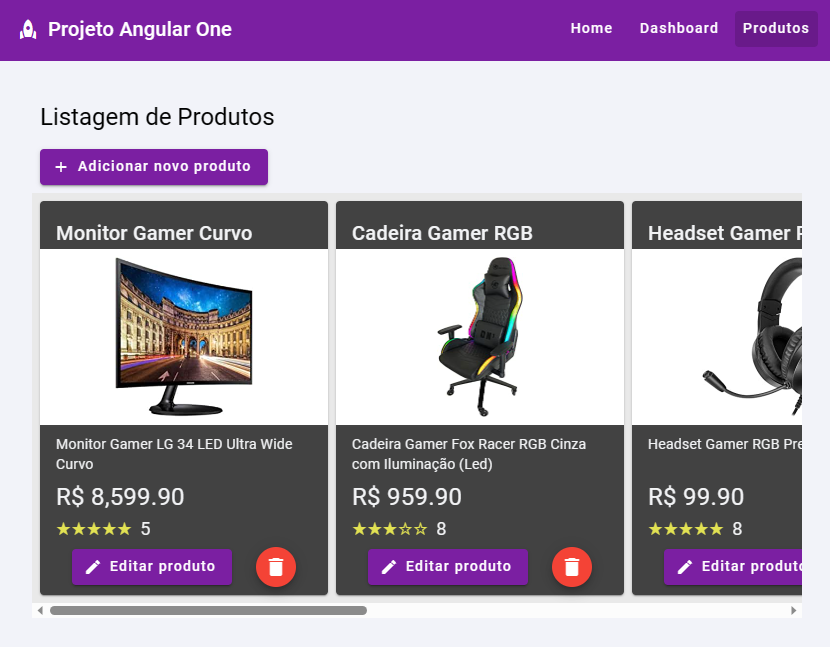
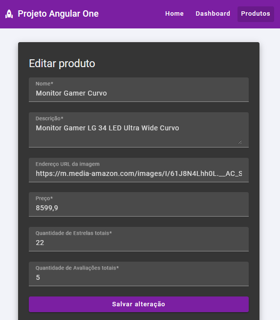
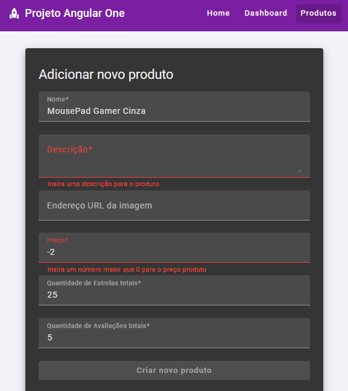

# Projeto Angular One

Repositório de estudo sobre o Angular 16, foi criado principalmente um CRUD de produtos simples utilizando json-server como servidor.

    <kbd>
        
    </kbd>

    <kbd>
        
    </kbd>

    <kbd>
        
    </kbd>

## Servidor no ambiente de desenvolvimento

Baixe as dependências com o `npm install`

Deixe rodando em um terminal a parte o servidor do **json-server**, usando o comando `npm run server`

Execute o comando `ng serve` para iniciar o servidor Angular no ambiente de desenvolvimento. Depois use a URL `http://localhost:4200/`.

## Outros comandos (em Inglês)

### Build

Run `ng build` to build the project. The build artifacts will be stored in the `dist/` directory.

### Executando testes unitários (unit tests)

Run `ng test` to execute the unit tests via [Karma](https://karma-runner.github.io).

### Rodando testes end-to-end

Run `ng e2e` to execute the end-to-end tests via a platform of your choice. To use this command, you need to first add a package that implements end-to-end testing capabilities.

### Ajuda na aplicação do Angular

To get more help on the Angular CLI use `ng help` or go check out the [Angular CLI Overview and Command Reference](https://angular.io/cli) page.
